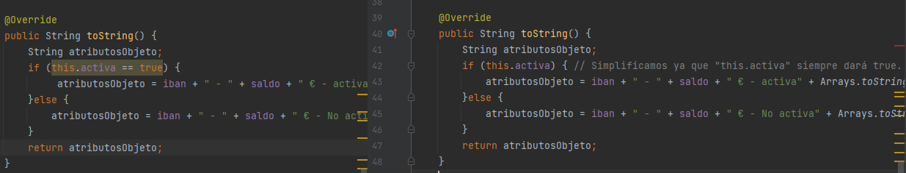

# Práctica de Clean Code
### Clean code es un término utilizado para describir código que es fácil de leer, entender y mantener.
### En general, se refiere a un estilo de programación que hace hincapié en la legibilidad y la claridad del código.

**1. El objetivo principal del clean code es crear un software de alta calidad que sea fácil de entender y modificar.**

**Esto se logra mediante el uso de convenciones de nomenclatura significativas, estructuras de código simples y fáciles de leer,
y comentarios claros y precisos. Al seguir estas convenciones, los programadores pueden crear código que sea fácil de entender y mantener, lo que a su vez reduce el tiempo de desarrollo y mejora la calidad del software.**

**Entre los principios que se pueden aplicar al escribir código limpio se encuentran:
la simplicidad, la claridad, la eficiencia, la consistencia, la legibilidad, la modularidad y la reusabilidad.
Al seguir estos principios, se puede crear código que sea fácil de entender y mantener, lo que a su vez mejora la calidad y la eficiencia del software.**

---

**2. En este ejercicio se han reemplazado dos bucles FOR I por un FOREACH.**

---

**3. Se ha simplificado el metodo toString ya que en el if "this.activa" simpre dará true.**

---

**4. En el siguiente codigo se pueden apreciar algunas definiciones recomendadas por CLEAN CODE**
- Las funciones son lo suficientemente pequeñas para ser fácilmente comprendidas y reutilizadas en otras partes del código.
- Los nombres de variables y métodos son descriptivos y significativos.
- Las funciones tienen un propósito claro y conciso.
- El código es fácil de leer y entender, con una estructura de código clara y consistente.
- Se utiliza el encapsulamiento para proteger las variables y métodos internos de la clase.

**El encapsulamiento permite proteger los datos de la clase y controlar el acceso a ellos desde fuera de la misma.**

---

**5. A continuación se muestra un ejemplo de cómo se puede aplicar el principio de cohesión en una clase Java utilizando Clean Code.**

public class Calculadora {

    public int sumar(int num1, int num2) {
        return num1 + num2;
    }
    public int restar(int num1, int num2) {
        return num1 - num2;
    }
    public int multiplicar(int num1, int num2) {
        return num1 * num2;
    }
    public double dividir(int num1, int num2) {
        if (num2 == 0) {
            System.out.println("El segundo número no puede ser cero");
        }
        return (double) num1 / num2;
    }
}

- La clase "Calculadora" se centra en proporcionar operaciones matemáticas y todas las operaciones están relacionadas entre sí.
- Cada método realiza una tarea específica relacionada con operaciones matemáticas y no tiene responsabilidades adicionales.
- Cada método utiliza los parámetros de entrada solo para realizar la operación matemática correspondiente y no tiene dependencias adicionales.
- Todos los métodos están públicos ya que se espera que sean utilizados por otras clases.

**Por lo tanto, se puede decir que la clase "Calculadora" es altamente cohesiva ya que todos sus métodos están estrechamente relacionados entre sí y trabajan juntos para proporcionar una funcionalidad específica.**
